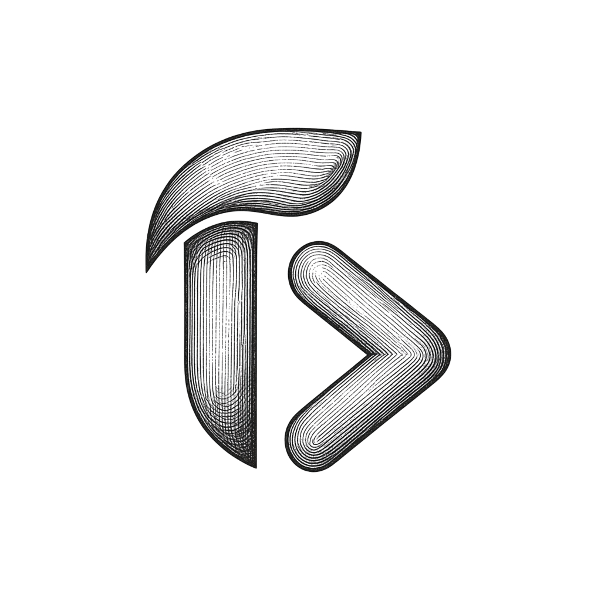

<p align="center">
  
</p>

<h1 align="center">TYSH</h1>

<p align="center">
  <strong>A modern, high-performance code editor built for power users and creators.</strong>
</p>

<p align="center">
  <a href="#features">Features</a> •
  <a href="#getting-started">Getting Started</a> •
  <a href="#development-workflow">Development Workflow</a> •
  <a href="#packaging--distribution">Packaging</a> •
  <a href="#marketplace-support">Marketplace</a> •
  <a href="#architecture">Architecture</a> •
  <a href="#license">License</a>
</p>

---

## ⚡ Overview

**TYSH** is a customized, next-generation code editor built on top of the open-source Code-OSS foundation. Engineered for speed, aesthetic polish, and seamless developer workflows, TYSH combines the flexibility of modern editor architectures with built-in access to the Visual Studio Marketplace, bespoke themes, enhanced branding, and AI agent readiness.

---

## ✨ Features

- 🎨 **Modern Aesthetics & Visual Identity**: Customized UI design, refreshed app icon, refined dark and light themes, and cohesive iconography.
- 📦 **Visual Studio Marketplace Integration**: Native, out-of-the-box access to the complete Visual Studio Code extension ecosystem. Install, manage, and update extensions seamlessly.
- 🤖 **AI & Agent-Ready**: Built-in support and optimized packaging for AI coding assistants, Copilot SDK shims, and intelligent code completions.
- 🚀 **Blazing Fast Performance**: Powered by Electron and modern TypeScript with tuned incremental compilation and optimized build pipelines.
- 🛠️ **Full Debugging & Language Support**: Rich language servers, syntax grammars, integrated terminal, and advanced multi-target debugging.
- 🌐 **Cross-Platform Foundation**: Built for macOS (Apple Silicon & Intel), Linux, and Windows.

---

## 🚀 Getting Started

### Prerequisites

Ensure you have the following installed on your system:

- **Node.js**: `v20.x` or `v24.x` (LTS recommended)
- **Git**
- **Platform Build Tools**:
  - **macOS**: Xcode Command Line Tools (`xcode-select --install`)
  - **Linux**: Standard build essentials (`build-essential`, `libx11-dev`, `libxkbfile-dev`, `libsecret-1-dev`)
  - **Windows**: Visual Studio C++ build tools and Python 3

### Installation

1. **Clone the repository:**
   ```bash
   git clone https://github.com/anshxs/tysh.git
   cd tysh
   ```

2. **Install dependencies:**
   ```bash
   npm install
   ```

---

## 💻 Development Workflow

### 1. Incremental Compilation / Watch Mode

To continuously watch and compile TypeScript sources:

```bash
npm run watch
```

Alternatively, run a one-time build:

```bash
npm run compile
```

### 2. Launching TYSH in Development

Once compilation completes, launch the development instance using:

```bash
./scripts/code.sh
```

> **Tip:** If the native Electron executable needs to be refreshed or downloaded, run:
> ```bash
> npm run electron
> ```

---

## 📦 Packaging & Distribution

TYSH includes Gulp-based packaging scripts to build standalone application bundles.

### Developer Package (macOS)
Creates a local standalone build in the parent directory:
```bash
npm run gulp vscode
```

### Minified Release Build (macOS Apple Silicon)
Builds an optimized, production-ready `TYSH.app`:
```bash
npm run gulp vscode-darwin-arm64-min-ci
```

The packaged distribution will be generated at:
```
../VSCode-darwin-arm64/TYSH.app
```

---

## 🔌 Marketplace Support

TYSH is preconfigured with direct access to the Visual Studio Marketplace.

Configuration is declared in `product.json`:
```json
"extensionsGallery": {
  "serviceUrl": "https://marketplace.visualstudio.com/_apis/public/gallery",
  "itemUrl": "https://marketplace.visualstudio.com/items",
  "resourceUrlTemplate": "https://{publisher}.vscode-unpkg.net/{publisher}/{name}/{version}/{path}",
  "controlUrl": "https://az764295.vo.msecnd.net/extensions/marketplace.json"
}
```

You can search, install, and update themes, linters, keymaps, and language packs straight from the Extensions view (`Cmd+Shift+X` / `Ctrl+Shift+X`).

---

## 🏗️ Architecture

```
tysh/
├── src/
│   ├── vs/
│   │   ├── base/          # Independent utility functions and core primitives
│   │   ├── platform/      # Service definitions and platform contracts
│   │   ├── editor/        # Monaco code editor core
│   │   ├── workbench/     # Full IDE shell, panels, layouts, and views
│   │   ├── code/          # Electron main process entrypoints
│   │   └── server/        # Remote and web server components
├── extensions/            # Built-in language features, grammars, and themes
├── build/                 # Gulp tasks, compilation scripts, and packaging pipelines
├── resources/             # Icons, OS-specific assets (icns, png, ico), and plist templates
├── product.json           # Application branding, metadata, and service endpoints
└── package.json           # Project manifest and task scripts
```

---

## ⚙️ Configuration & Customization

- **Application Branding**: Configured via `product.json` (`nameShort: "TYSH"`, `applicationName: "tysh"`).
- **Application Icons**:
  - macOS: `resources/darwin/code.icns`
  - Linux: `resources/linux/code.png`
  - Windows: `resources/win32/code_150x150.png`

---

## 📄 License

TYSH is open-source software licensed under the [MIT License](LICENSE.txt).
Based on the open-source [Code-OSS](https://github.com/microsoft/vscode) codebase.
